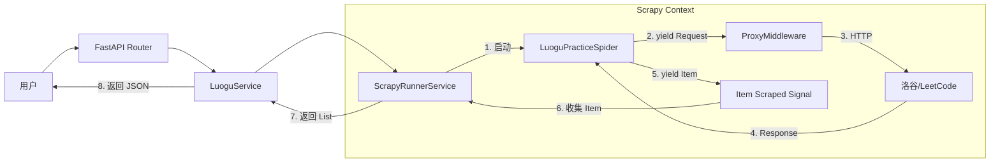

# Scrapy 框架深度解析：从入门到 FastAPI 集成实战（基于 Crawler Center 项目）

> **摘要**：本文以 `crawler_center_scrapy` 项目为例，深入浅出地讲解 Scrapy 爬虫框架的核心概念，并重点剖析如何将 Scrapy 与 FastAPI 现代异步 Web 框架完美融合。无论是初学者希望了解 Scrapy 的工作原理，还是资深开发者寻找 Scrapy + FastAPI 的最佳实践，本文都能提供有价值的参考。

---

## 1. Scrapy 框架简介：它是谁？

Scrapy 是 Python 生态中最强大、最成熟的**异步**网络爬虫框架。与简单的 `requests` + `BeautifulSoup` 脚本不同，Scrapy 是一个**框架**，它提供了一整套构建爬虫系统的组件，包括：

- **高性能异步核心**（基于 Twisted）：并发处理成百上千个请求。
- **强大的选择器**（Selectors）：基于 XPath 和 CSS 提取数据。
- **中间件机制**（Middlewares）：灵活拦截请求和响应（处理 Cookie、代理、User-Agent 等）。
- **管道系统**（Pipelines）：清洗、验证和存储数据。

在本项目 `crawler_center_scrapy` 中，我们并没有像传统方式那样通过命令行 `scrapy crawl` 启动爬虫，而是将其**作为库**集成到了 FastAPI 服务中，实现了“即时请求，即时抓取”的 API 服务。

---

## 2. 核心组件详解（结合本项目代码）

让我们通过项目中的实际代码，一一拆解 Scrapy 的核心组件。

### 2.1 Spider（蜘蛛）—— 业务逻辑的核心

Spider 是定义“怎么爬”的地方。它负责生成初始请求，并解析返回的响应。

**代码示例：`crawler_center/crawler/spiders/luogu_practice.py`**

```python
class LuoguPracticeSpider(scrapy.Spider):
    name = "luogu_practice"  # 爬虫唯一标识

    def start_requests(self):
        """1. 入口：生成初始请求"""
        yield scrapy.Request(
            url=self.practice_url(),
            callback=self.parse_practice,  # 指定回调函数
            headers={"x-lentille-request": "content-only"},
            meta={"target_site": self.target_site},  # 传递元数据给中间件
        )

    def parse_practice(self, response: scrapy.http.Response):
        """2. 回调：解析响应"""
        # ... 省略错误处理 ...
        
        # 3. 提取数据（使用 Parser 分离逻辑）
        context = extract_lentille_context(response.text)
        
        # 4. 产出 Item（数据）
        yield parse_luogu_practice_context(context)
```

**关键点：**
- **`start_requests`**：爬虫启动时被调用，产出第一批 Request。
- **`yield`**：Scrapy 是基于生成器的，Request 和 Item 都是通过 `yield` 抛给引擎的。
- **`callback`**：异步的核心，请求发出去就不管了，等响应回来后 Scrapy 会自动调用你指定的方法。

### 2.2 Middlewares（中间件）—— 请求/响应的拦截器

中间件处于引擎和下载器之间。请求发出去前、响应回来后，都会经过它。这是做**全局控制**（如代理、重试、Cookie）的最佳场所。

**代码示例：`crawler_center/crawler/middlewares.py`**

```python
class ProxyHealthMiddleware:
    def process_request(self, request: Request, spider: object = None) -> None:
        """请求发出前：注入代理"""
        proxy_service = get_proxy_service()
        # 从代理池获取代理 URL
        proxy_url = proxy_service.acquire_proxy(target)
        # 设置给 Scrapy，它会自动走这个代理
        request.meta["proxy"] = proxy_url

    def process_response(self, request: Request, response: Response, spider: object = None) -> Response:
        """响应回来后：反馈健康状态"""
        # 根据状态码判断代理是否好用，上报给 ProxyService
        proxy_service.report_status(...)
        return response
```

**关键点：**
- **`process_request`**：返回 `None` 继续处理，返回 `Response` 则直接截断（不发网络请求了）。
- **`request.meta`**：在 Request 生命周期内传递上下文数据的“背包”。

### 2.3 Settings（配置）—— 系统的控制台

Scrapy 的行为高度可配置。在本项目中，我们通过 `crawler_center/crawler/settings.py` 动态构建配置。

```python
def build_scrapy_settings(app_settings: AppSettings) -> Settings:
    settings = Settings()
    settings.set("DOWNLOAD_TIMEOUT", app_settings.default_timeout_sec)
    settings.set("CONCURRENT_REQUESTS", app_settings.crawler_concurrent_requests)
    # 注册我们的中间件
    settings.set("DOWNLOADER_MIDDLEWARES", {
        "crawler_center.crawler.middlewares.ProxyHealthMiddleware": 543,
    })
    return settings
```

---

## 3. 高阶实战：Scrapy + FastAPI 完美融合

这是本项目最精华的部分。Scrapy 基于 Twisted（旧时代的异步王者），而 FastAPI 基于 asyncio（新时代的异步标准）。如何让它们共存？

### 3.1 核心挑战：事件循环冲突

Scrapy 默认有自己的事件循环（Reactor），FastAPI 也有（uvloop/asyncio）。如果不做处理，直接在 FastAPI 里跑 `CrawlerRunner` 会导致主线程阻塞或报错。

### 3.2 解决方案：`asyncioreactor` + `ScrapyRunnerService`

**代码解析：`crawler_center/crawler/runner.py`**

#### 第一步：安装 Reactor 补丁

在任何 Scrapy 模块导入前，先安装 `AsyncioSelectorReactor`，让 Scrapy 使用 asyncio 的事件循环。

```python
from scrapy.utils.reactor import install_reactor
install_reactor("twisted.internet.asyncioreactor.AsyncioSelectorReactor")
```

#### 第二步：通过信号（Signals）收集数据

在 API 模式下，我们需要拿到爬虫爬到的数据并返回给前端，而不是存数据库。这里使用了 `crawler.signals.item_scraped` 信号。

```python
    async def run(self, spider_cls: Type[Spider], **spider_kwargs) -> List[Dict[str, Any]]:
        collected_items = []

        # 1. 创建 Crawler 实例
        crawler = self._runner.create_crawler(spider_cls)

        # 2. 注册信号回调：每当爬到一个 Item，就放到列表里
        def _on_item_scraped(item, response, spider):
            collected_items.append(dict(item))
        
        crawler.signals.connect(_on_item_scraped, signal=signals.item_scraped)

        # 3. 启动爬虫（异步非阻塞）
        deferred = self._runner.crawl(crawler, **spider_kwargs)
        
        # 4. 等待完成（将 Twisted Deferred 转为 asyncio Future）
        await deferred_to_future(deferred)

        return collected_items
```

### 3.3 架构图解



---

## 4. 为什么这么设计？（设计模式思考）

### 4.1 Parser 纯函数化
在 `crawler_center/crawler/parsers/` 下，你会发现解析逻辑都是**纯函数**。
- **优点**：解析逻辑与网络请求解耦。你可以把 HTML 下载下来，编写单元测试只测解析逻辑（如 `tests/crawler/test_parsers.py`），而不需要每次都发网络请求。

### 4.2 依赖注入（Dependency Injection）
Scrapy 的类实例化由框架控制，很难传参。本项目通过 `set_proxy_service` 全局变量注入的方式，让 Middleware 能访问到 FastAPI 的 `ProxyService`。虽然是妥协，但在单进程模型下非常有效。

### 4.3 统一错误处理
Spider 不直接抛异常，而是 yield 一个特殊的 `_error` Item。
- **目的**：保证爬虫流程不中断，将错误抛给 Service 层，由 Service 层决定是重试、报错还是忽略，完美契合 HTTP 状态码映射。

---

## 5. 总结

通过本项目，我们不仅学习了 Scrapy 的基础（Spider, Middleware, Settings），更掌握了将其容器化、服务化的高级技巧：
1.  **利用 `asyncioreactor` 打通 asyncio 与 Twisted。**
2.  **利用 `signals` 实现内存级数据回流。**
3.  **利用 Parser 分层实现高可测试性。**

希望这篇文章能帮你建立起对 Scrapy 框架的立体认知！
